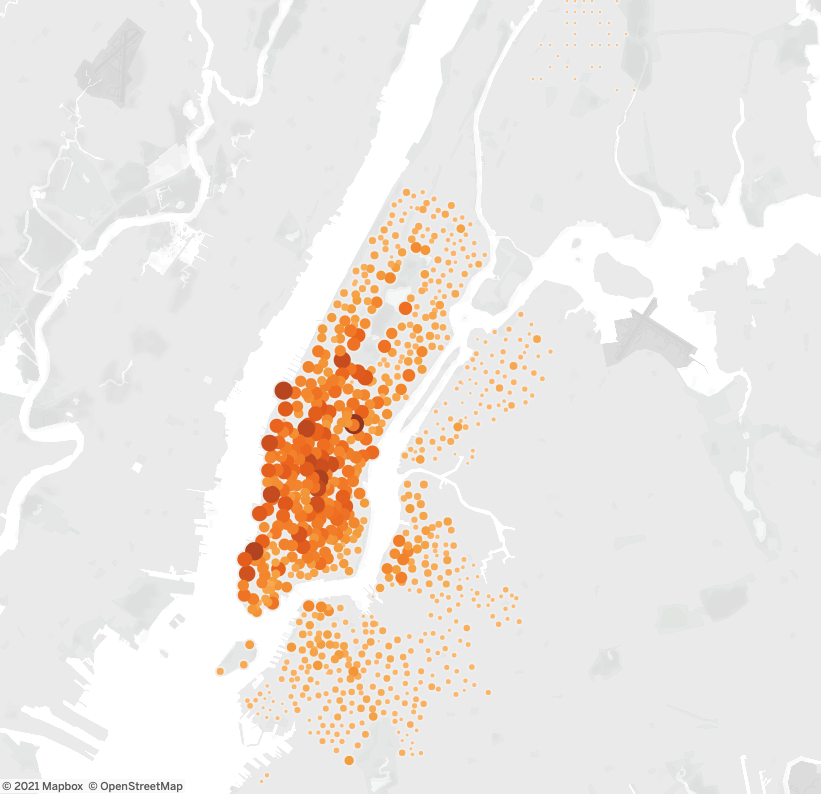

# NYCitibike
Columbia Data Analytics Module 14 - Using Tableau, this project will present a business proposal for a bike-sharing company. _Note_: The dataset used for this project is available on https://s3.amazonaws.com/tripdata/index.html - I just had to 
place that folder in the gitignore file to keep my repository light and clean.

## What I Learned/Achieved:
- How to import data into Tableau.
- How to create and style worksheets, dashboards, and stories in Tableau.
- How to use Tableau worksheets to display data in a professional way.
- How to portray data accurately using Tableau dashboards. 

## Deliverables:
1. Change 'tripduration' to a 'datetime' format;
2. Create visualizations for the analysis, create the checkouttimes by gender viz, create the trips by weekday for each
   hour viz, create the trips by weekday for each hour viz, create the trips by gender (weekday per hour) viz, create
   user trips by gender by weekday viz;
3. Create a story and report for the final presentation.

Follow this link for [David's Public Tableau Board](https://public.tableau.com/profile/david.adams2751#!/vizhome/CitibikeUsageinNYC_16208434735690/CitibikeUsageinNYC) . See below for a preview of the Top End Locations of the NYC Citibikes from my analysis.

## Summary:
There were times that saw more people using bikes than others. There were places that saw more bikes being picked up and dropped off at other locations. There were differences in the bike usage by gender. To best make any real conclusions, further data is needed to understand the distance the bike users travelled, the count of different demographics in certain areas by both inhabitation levels and work levels, and the revenue made. With this extra data, the visualizations we created here will be more versatile for insights into business and usage intelligence.
